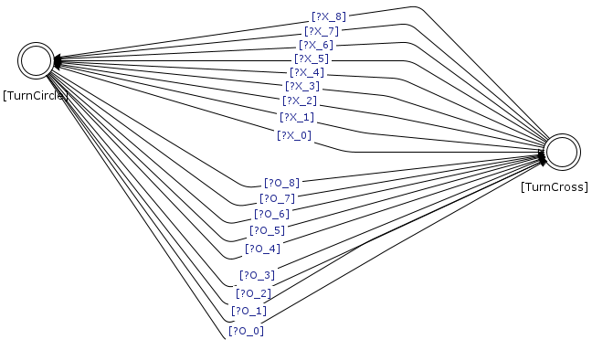

# Tic-tac-toe

This repository contains an implementation of the tic-tac-toe game.
This software is an example of usage of the contract automata library (CATLib). 
The example is twofold: 
<ul>
<li> it provides an example of modelling the game as contract automata, and using the operations of composition and synthesis to compute 
the strategy for a player to never lose a game,</li>
<li> it also provides an example of how to use the automata to realize an application (the game) whose control flow is internally orchestrated by the synthesised 
contract.</li>
</ul>

The synthesised strategy is <em>most permissive</em>: all plays in which the computer ties or wins are 
in the strategy. 
To keep this example as simple as possible, no optimization is performed to reduce the state-space.
In particular, there are 3878 reachable configurations in the strategy of player X and 2094 in the strategy of player O.

### Getting started

The easiest way to start is to download the released jar files of this repository (see Releases in the right column). 
These files are runnable from command-line, and  they only require a Java distribution compatible with version 11.

To play the game type:
```console
java -jar tictactoe-0.0.3-SNAPSHOT-jar-with-dependencies.jar
```

To synthesise the strategies type: (the strategies will be stored in the same folder where the jar is located).
```console
java -jar tictactoeBuildStrategy-0.0.3-SNAPSHOT-jar-with-dependencies.jar
```

Otherwise, clone the repository and see below for information about the classes.

### Implementation

The two executable classes are `App.java` (the game) and `AppBuildStrategy.java` (creation of the automata).

`App.java` contains the game, whilst  `AppBuildStrategy.java` is used to create (offline) the strategies that 
are used by `App.java` to play the game. The used automata are built or synthesised inside `AppBuildStrategy.java`.

Inside the package `grid`, the class `Grid.java` provides methods to check if a configuration is winning for some player or if it is a tie. 
This class has also facilities to print at console the current configuration of the game, and to import/export 
a configuration stored as label of a state of an automaton.

Finally, inside the package `symbols`, the class `Symbol.java` and its sub-classes `Circle.java` and `Cross.java` are used to store 
information about the representation of each player.

#### Synthesis 

Concerning the realization of the strategy, as stated above this is implemented in `AppBuildStrategy.java`.
Firstly, 9 automata are instantiated, each one represents the typing of X or O to a specific position. 
Each of these automata has three states (no symbol, X or O). The one for position 0 is displayed below.


A further automaton `turns` (depicted below) is necessary for enforcing turns between X and O, where X is the first to move.
This automaton has two states, one for each turn. 
From each turn/state, there are 8 outgoing transitions to the other state.



The composition of these 9+1 automata is firstly computed. 
In the composition, the requests of `turns` are all matched by the offers of one of the other 
automata in the composition, so that all transitions in the composition are matches between an offer and a request.
After that, depending on which player is selected, the composed automaton is further refined before 
starting the synthesis. 
The moves of the opponent are turned to uncontrollable, transitions outgoing winning states are removed (for both players), and only the configurations where the selected player wins or ties are marked as final. 
To check if a state is winning or draw, the class `Grid.java` is used: an object is instantiated by passing as argument the state, and subsequently the corresponding methods of `Grid.java` are invoked.

The synthesis algorithm formally guarantees that the strategy has the maximal behaviour where a final state is reachable, forbidden states where the opponent wins are 
never traversed, and uncontrollable transitions are never blocked. 
Below is an image of the (automatically computed) strategy for player O.
The images of the automata have been created using CAT_App.


#### Using the automata

The class `App.java` realises the game. 
The application allows to play either O or X, and loads the corresponding strategy of the opponent. 
The control flow is orchestrated by the strategy. 
Initially, the game starts from the initial state (an empty grid). 
Before selecting the next move, it is checked whether the current state is a tie state or a win state.
If it is not the case, depending on the turn (an information available in the state), the user can enter a move  
or the opponent will select the next move. 
Only moves that are outgoing transitions from the current state are possible. 
This suffices to guarantee that all and only valid moves are possible (e.g., it is not possible to assign  an already occupied position).


### License

This software is available under GPL-3.0 license.


### Contacts

For further information contact me at davide.basile@isti.cnr.it
